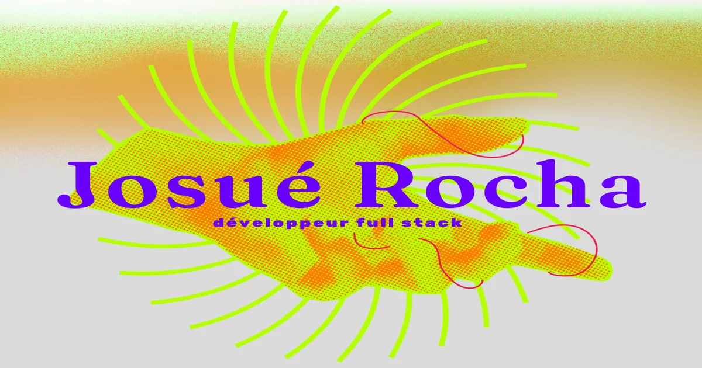

<div align="center">

# josuerocha.dev

**Portfolio personnel trilingue, accessible et performant.**


[Demo](https://josuerocha.dev) · [Portfolio](https://josuerocha.dev) · [Signaler un bug](https://github.com/josuerochadev/portfolio/issues)

</div>

---

## A propos

Ce portfolio est le socle de ma presence en ligne en tant que developpeur. Il presente mes projets, mon parcours et mes competences techniques. Le site est trilingue (francais, anglais, portugais), concu avec une attention particuliere a l'accessibilite et aux performances web.

Construit pendant ma reconversion vers le mainframe, ce projet m'a permis de consolider mes acquis React/TypeScript tout en explorant les standards modernes du web (WCAG, Core Web Vitals, testing E2E).

<!-- Screenshot : remplacer par une capture recente du site -->


## Fonctionnalites

- Interface trilingue FR/EN/PT avec detection automatique de la langue du navigateur
- Animations fluides avec Framer Motion et smooth scroll via Lenis
- Pages projet detaillees avec navigation contextuelle
- Conformite WCAG AA : skip links, navigation clavier, support reduced-motion, contrastes valides
- Error boundaries multi-niveaux (app, page, section)
- Score Lighthouse 85+ en performance, 95+ en accessibilite
- Deploiement continu sur Vercel avec preview sur chaque PR

## Stack technique

| Categorie | Outils |
|---|---|
| Framework | React 19, React Router v7 |
| Langage | TypeScript (strict) |
| Build | Vite 5 |
| Styles | Tailwind CSS 3, plugins forms/typography/aspect-ratio |
| Animations | Framer Motion, Lenis (smooth scroll) |
| i18n | i18next, react-i18next, i18next-browser-languagedetector |
| Tests unitaires | Vitest, Testing Library |
| Tests E2E | Playwright |
| Qualite | ESLint, Biome |
| Performance | Lighthouse CI |
| Analytics | Vercel Analytics |
| Deploiement | Vercel |

## Demarrer

### Prerequis

- Node.js 18+
- npm

### Installation

```bash
git clone https://github.com/josuerochadev/portfolio.git
cd portfolio
npm install
npm run dev
```

Le site sera accessible sur `http://localhost:5173`.

### Scripts disponibles

| Script | Description |
|---|---|
| `npm run dev` | Serveur de developpement avec HMR |
| `npm run build` | Build de production |
| `npm run preview` | Preview du build de production |
| `npm run lint` | Linting ESLint |
| `npm run test` | Tests unitaires (mode watch) |
| `npm run test:run` | Tests unitaires (execution unique) |
| `npm run test:coverage` | Couverture de code |
| `npm run test:e2e` | Tests end-to-end Playwright |
| `npm run test:e2e:ui` | Interface graphique Playwright |
| `npm run lighthouse` | Audit Lighthouse CI |
| `npm run release:check` | Verification pre-release (tests + lint + changelog) |

## Architecture

```
src/
├── assets/              # Images et ressources statiques
├── components/
│   ├── common/          # Composants reutilisables (animations, layout)
│   ├── effects/         # Effets visuels (ripple, grilles)
│   ├── layout/          # Structure de page (navbar, footer)
│   └── sections/        # Sections specifiques (hero, bio)
├── constants/           # Constantes (couleurs, animations)
├── data/                # Donnees statiques des projets
├── hooks/               # Hooks personnalises
├── i18n/
│   └── locales/         # Traductions FR, EN, PT
├── pages/               # Pages (home, project-detail, legal, 404)
├── utils/               # Fonctions utilitaires
└── __tests__/           # Tests unitaires
e2e/                     # Tests end-to-end Playwright
docs/                    # Documentation technique (patterns, performance, workflow)
```

---

Construit par **[Josue Rocha](https://josuerocha.dev)** · [LinkedIn](https://linkedin.com/in/josuerocha) · [GitHub](https://github.com/josuerochadev)
